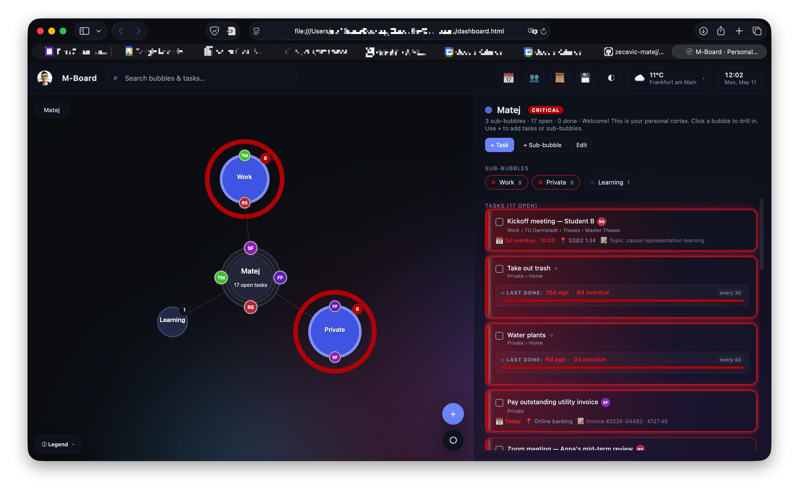

# M-Board

*Vibe coded with the help of Claude Opus 4.7*



A single-file personal dashboard with a force-directed bubble graph of your tasks, a recurring-task / urgency model, a calendar, a people directory with avatar bubbles on the graph, a completion-history view, and a Safari-friendly export / sync pipeline that writes both machine-readable JSON and a human-readable Markdown journal.

Everything lives in one `dashboard.html` — open it locally in any browser and it boots from `localStorage`. D3, marked, DOMPurify and JSZip are loaded from CDNs; no build step.

## Quick start

```sh
git clone https://github.com/zecevic-matej/M-Board.git
cd M-Board
# Open the dashboard in your default browser
open dashboard.html        # macOS
xdg-open dashboard.html    # Linux
```

Replace `causanostra.jpg` with your own profile photo (same filename) to keep the topbar avatar working.

The dashboard has some made-up mock data in-store to easily check the existing functionalities when first starting out.

## Data, sync & backup

Click 💾 (or press `D`) inside the dashboard:

- **Save snapshot** — downloads a ZIP with all your data (`contacts.json`, `tasks-tree.json`, `completed-history.json`, `daily-log.json`, `dashboard-backup.json`, `journal.md`, `README.md`) inside a `dashboard-logs/` folder. Works in every browser.
- **Auto-snapshot on every change** — Safari-friendly: same ZIP, debounced after each save.
- **Live folder sync** — Chrome / Edge bonus: pick a folder once and M-Board writes files there directly.
- **Per-file download** — grab just `journal.md`, just `contacts.json`, etc.
- **Import** — full backup or contacts-only, with merge / replace prompt.

The `dashboard-logs/` folder is `.gitignore`d by default (its README is committed for reference); your data lives only on your machine.

## Keyboard shortcuts

| Key | Action |
|-----|--------|
| `← ↑ ↓ →` | Walk children (or tasks on a leaf) |
| `Tab` | Drill into highlighted child |
| `Enter` | Drill / open highlighted task |
| `Backspace` | Up one level |
| `Esc` | Jump to M-Board top (also resets zoom) |
| `/` | Focus search |
| `H` | History |
| `P` | People |
| `D` | Data & backup |
